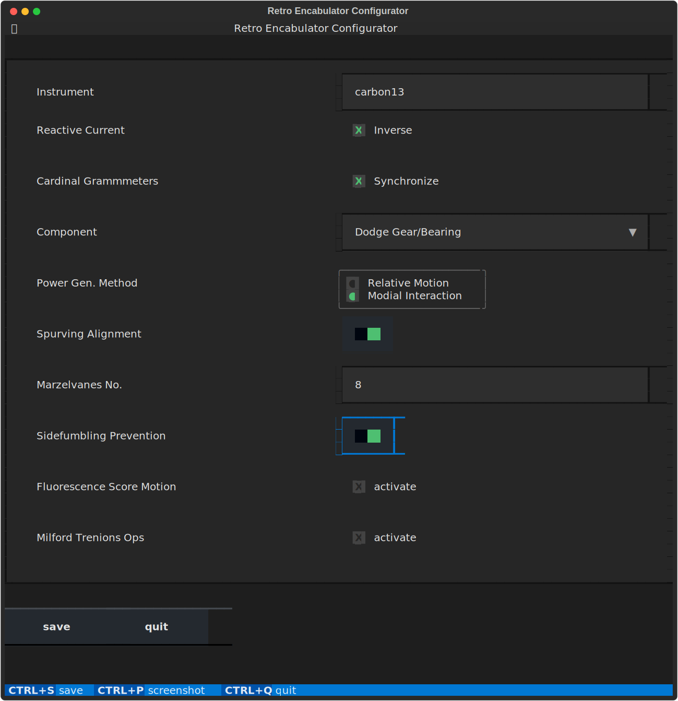

==========================
PHOTON Platform Formulator
==========================

Formulator is a library for dynamically generating terminal-based forms using
Python and the Textual library. Forms are defined using a simple YAML blueprint
format that specifies the form fields, their types, and their validation rules.
The Formulator library interprets this blueprint and generates a form that can
be interacted with in the terminal. When the form is submitted, Formulator
validates the input values against the validation rules and displays any
errors. It's a handy tool for collecting user input from the terminal in a
structured and validated manner.

.. warning::
   this is a very early concept and is likely to change frequently

Installation
============
Install Formulator with pip:

.. code-block:: bash

    pip install photon-platform-formulator

Usage
=====
To use Formulator, first define your form blueprint in a YAML file. For example:

.. code-block:: yaml

    form:
      title: Retro Encabulator Configurator
      id: retro-encabulator
      fields:
        instrument-name:
          label: Instrument
          placeholder: Enter Name
          type: Input
          validate:
            required: true
            max_length: 8
        # ...

Then, in your Python script, load the blueprint and pass it to the Formulator class:

.. code-block:: python

    from photon_platform.formulator import Formulator, load_blueprint

    blueprint = load_blueprint("blueprint.yaml")
    form = Formulator(blueprint)
    reply = form.run()

Features
========

Formulator comes packed with a range of features that make it easy and efficient to generate dynamic forms:

1. **Simple Blueprint Definition**: Formulator uses a simple and intuitive YAML
   blueprint to define form fields, types, options, and validation rules. This
   makes it easy to create complex forms without writing any code.

2. **Dynamic Form Generation**: Based on the provided YAML blueprint,
   Formulator dynamically creates an interactive form in the terminal. This
   includes a variety of field types such as input boxes, checkboxes, radio
   buttons, and select dropdowns.

3. **Custom Validation**: Formulator comes with a default set of validation
   rules, including checks for required fields, minimum and maximum lengths,
   numeric and alphabetic values, and email format. However, you can also
   define your own validation rules by extending the Validator class.

4. **Flexible Layout**: Formulator uses the Composer class to layout the form
   widgets. You can override the default Composer class to customize the layout
   according to your needs.

5. **Form Submission and Error Handling**: When the form is submitted,
   Formulator validates the input values against the validation rules and
   displays any errors in a pop-up window. If the form is valid, Formulator
   exits and returns a dictionary with the form values. This allows for
   seamless integration with your application logic.

Supported Textual Widgets
=========================

Formulator's Composer class is designed to work with a variety of Textual
widgets. Below is a list of the currently supported widgets:

1. **Input**: A basic text input field for user input.

2. **Checkbox**: A field that can be checked or unchecked by the user.

3. **RadioSet**: A set of radio buttons, where the user can select one option
   from several.

4. **Select**: A dropdown field where the user can select one option from a
   list.

5. **Switch**: A toggle switch that can be turned on or off.

6. **Button**: A clickable button, used in Formulator for form submission and
   quitting the application.

7. **Label**: A text label used for displaying field names and other
   information.

Please note that the appearance and behavior of these widgets can be customized
by overriding the Composer class, giving you flexibility in creating the user
interface for your form.

Command Line Usage
==================

You can use Formulator from the command line using the `formulator` command.

Once you have your blueprint, you can run Formulator with the `--blueprint` option:

.. code-block:: bash

    formulator --blueprint path/to/your/blueprint.yaml

The `--blueprint` option should be a path to a YAML file that contains your form blueprint. This will launch the Formulator app and display your form in the terminal. After you fill out and submit the form, the values you entered will be printed to the terminal as YAML.

Demos
-----

In the `demos` directory, you will find ready-made examples showcasing the power and flexibility of Formulator. These examples serve as a reference guide for creating your own complex forms, as well as demonstrating Formulator's functionality in configuring advanced machinery.

   
1. Retro Encabulator Configurator (retro_encabulator.py / retro_encabulator.yaml)

   This is a brilliant example of Formulator's capacity to streamline the configuration of advanced devices, such as the Retro Encabulator. With its modial interaction of magneto-reluctance and capacitive directance, the Retro Encabulator is a wonder of modern engineering. Configure everything from the cardinal grammeters synchronization to the number of hydrocoptic marzelvanes.

2. Flux Capacitor Configurator (flux_capacitor.py / flux_capacitor.yaml)

   Dive into time travel technology with Formulator, as it allows you to customize the settings of your own Flux Capacitor. Ensure that your Flux Capacitor is always set to the appropriate jigowatt level, and that your time circuits are functioning optimally. Remember, your future is whatever you make it, so make it a good one with Formulator.

3. Millenium Falcon Console (millenium_falcon.py / millenium_falcon.yaml)

   Step into the pilot's seat of the fastest hunk of junk in the galaxy with Formulator's Millenium Falcon console configurator. Tune the hyperdrive parameters, adjust the deflector shields, and calibrate the inertial dampeners to ensure your next Kessel Run is under twelve parsecs. Remember, she may not look like much, but she's got it where it counts, kid.

All demos include a Python script and a corresponding YAML blueprint. You can run the Python script directly to display the form in your terminal, or you can use the `formulator --blueprint` command with the YAML blueprint to achieve the same result.

Customization
=============

Formulator's behavior can be customized by providing your own Validator and
Composer classes. Validator is used to check the form input values against the
validation rules, and Composer is used to layout the form widgets.

.. code-block:: python

    from photon_platform.formulator import Formulator, Validator, Composer, load_blueprint

    class MyValidator(Validator):
        pass  # define your validation methods here

    class MyComposer(Composer):
        pass  # define your layout method here

    blueprint = load_blueprint("blueprint.yaml")
    form = Formulator(blueprint, validator=MyValidator(), composer=MyComposer())
    form.run()

More Information
================
For more information and examples, see the `Formulator GitHub page <https://github.com/photon-platform/formulator>`_.

